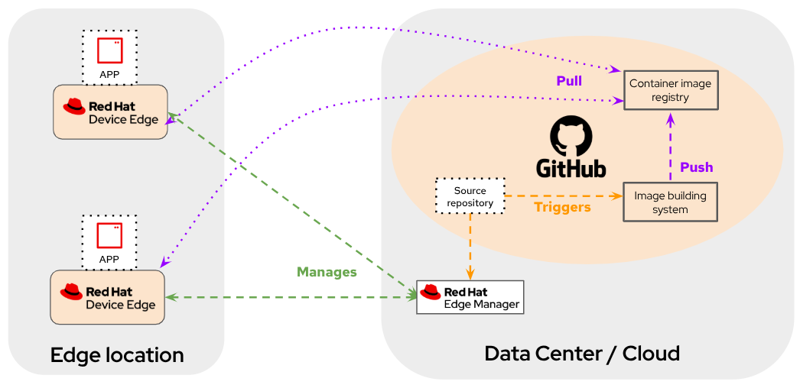

# Red Hat Edge Manager Demo

A comprehensive demo showcasing Red Hat Edge Manager (RHEM) capabilities for managing edge devices at scale. RHEM is product based on upstream [Flight Control project](https://github.com/flightctl/flightctl).

## What You'll Learn

- Zero-touch device onboarding at scale
- Image-based immutable operating systems with bootc RHEL
- Declarative application and configuration management
- Fleet management with templated configurations  
- Built-in observability and remote troubleshooting
- Secure pull-mode device communication

**Demo Duration:** ~90 minutes

## Demo Architecture




## Repository Structure

```
├── apps/          # Application definitions (Podman Compose + scratch Containerfiles)
├── devices/       # Bootc device image definitions  
├── configs/       # Runtime configuration files
├── fleets/        # RHEM fleet definitions
├── docs/          # Documentation and guides
└── .github/       # CI/CD workflows for image building
```

## Quick Start

1. **Clone and Configure**
   ```bash
   git clone https://github.com/luisarizmendi/rhem-demo
   cd rhem-demo
   ```

2. **Set up GitHub Actions** - See [Setup Guide](docs/01-setup.md)

3. **Deploy RHEM** - Follow [RHEM Deployment](docs/02-rhem-deployment.md)

4. **Prepare Demo Environment** - See [Demo Preparation](docs/03-demo-preparation.md)

5. **Run the Demo** - Follow [Demo Script](docs/04-demo-script.md)

6. **RHEM Value** - Follow [Demo Script](docs/05-value-propotitions.md)

## Demo Sections

| Section | Duration | Key Features |
|---------|----------|--------------|
| [Device Image Building](docs/04-demo-script.md#building-device-images) | 5 min | Bootc image creation, GitHub Actions |
| [Device Onboarding](docs/04-demo-script.md#device-onboarding) | 7 min | Zero-touch provisioning, enrollment |
| [Configuration Management](docs/04-demo-script.md#configuration-management) | 5 min | Runtime config updates |
| [Application Deployment](docs/04-demo-script.md#application-deployment) | 10 min | Container app management, upgrades |
| [OS Updates](docs/04-demo-script.md#os-updates) | 7 min | Image-based OS upgrades |
| [Observability](docs/04-demo-script.md#observability) | 3 min | Monitoring, remote access |
| [Fleet Management](docs/04-demo-script.md#fleet-management) | 10 min | Multi-device management, templates |

## Requirements

- Laptop with virtualization support.
- Red Hat subscription
- FlightCtl CLI
- VM software (KVM/VirtualBox/VMware)
- 4GB+ available RAM for VMs

## Documentation

- [📊 Slide Deck example](docs/LA%20-%20RHEM%20technical%20capabilities%20overview.pdf) - Presentation example

## Image Building

This repo uses GitHub Actions to automatically build:
- **Bootc device images** (`devices/` changes → `ghcr.io/owner/device-*`)
- **Application images** (`apps/compose` changes → `ghcr.io/owner/app-*`)

Images are built with automatic versioning.

You can [know more about the GitHub Actions workflow that builds the bootc images and how to setup your own pipeline here](./github_actions_workflow.md).

If you want to check other examples you can get some ideas from [`bootc-build-scenarios`](https://github.com/luisarizmendi/bootc-build-scenarios) repo.


## Support & Feedback

This demo uses a standalone RHEM deployment for simplicity. Production deployments follow different patterns.At this moment, for production deployments, RHEM is available through:
- Red Hat Ansible Automation Platform
- Red Hat Advanced Cluster Management
