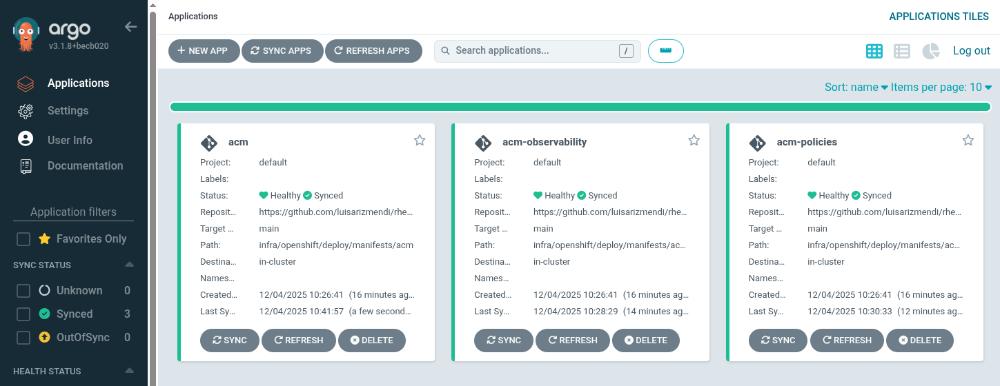

# RHEM Deployment Guide

This guide covers deploying Red Hat Edge Manager for the demo environment.

This demo can ben delivered with two kinds of deployments RHEM standalone or RHEM integrated with Red Hat Advanced Cluster Management (ACM).

If you plan to manage Microshift, you should deliver the demo with the ACM integration.


## Option 1: RHEM with ACM integration

1. Create an OpenShift Cluster (this demo was tested with OpenShift version `4.20`).

2. Click the `+` sign on the top right corner of the OpenShift console and select `Import YAML`

3. Paste the contents from [infra/openshift/deploy/bootstrap-environment.yaml](../infra/openshift/deploy/bootstrap-environment.yaml)

4. Click `Create` and wait until the login screen appears again.

5. Log in and click in the square grid on the top right of the console. Select `Cluster Argo CD`.

6. Log in using the OpenShift credentials, click the `Allow permissions` button and and wait several minutes until all the tiles are Healtry and Synced as in the image below. 





Once the environment is ready you will have access to RHEM under the `Edge Management` menu of the `Fleet Management` view (click drop-down menu on the top left of the UI to change the view).


## Option 2: RHEM Standalone Deployment Steps

Follow the steps in the [Getting Started guide in the Flightctl repo](https://github.com/flightctl/flightctl/blob/main/docs/user/getting-started.md).

Remember to obtain the config.yaml file:


```bash
flightctl login --username=<your_user> --password=<your_password> --insecure-skip-tls-verify  https://<rhem_api_server_url>
# or 
#flightctl login <API_URL> --insecure-skip-tls-verify --web

flightctl certificate request --signer=enrollment --expiration=365d --output=embedded > config.yaml
```


flightctl login <API_URL> --insecure-skip-tls-verify --web


### Demo Environment Notes

**Important:** When presenting, explain that:
- This is a standalone deployment for demo purposes. It uses less resources and you can deploy the latest capabilities in development 
- Production deployments integrate with existing Red Hat platforms

## Next Steps

With RHEM deployed and accessible, proceed to [Demo Preparation](03-demo-preparation.md) to build your demo images and environment.