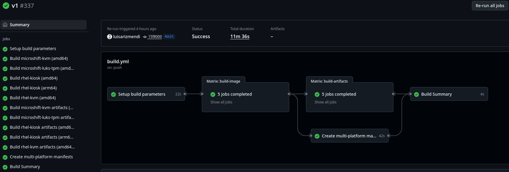
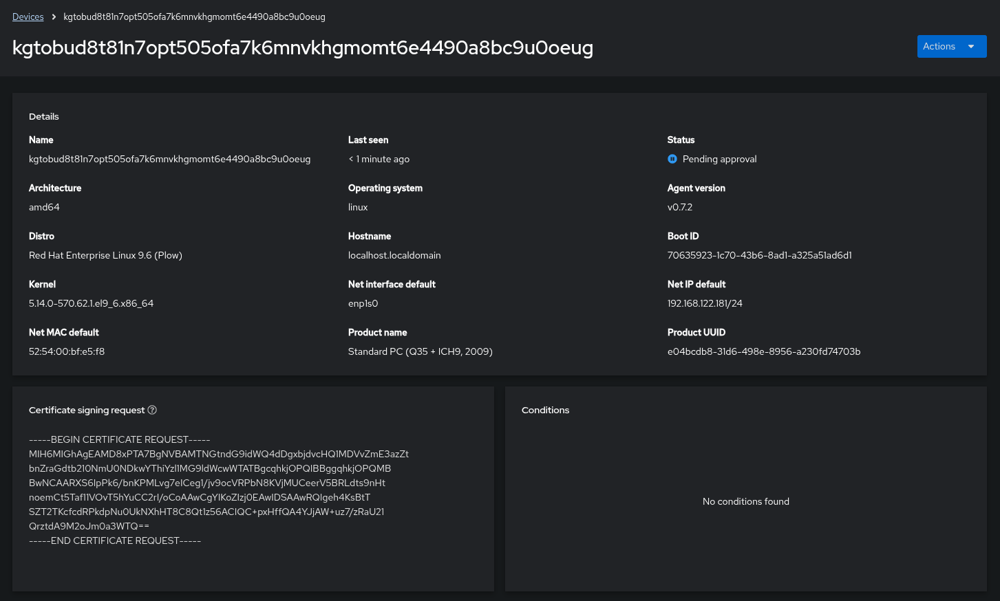
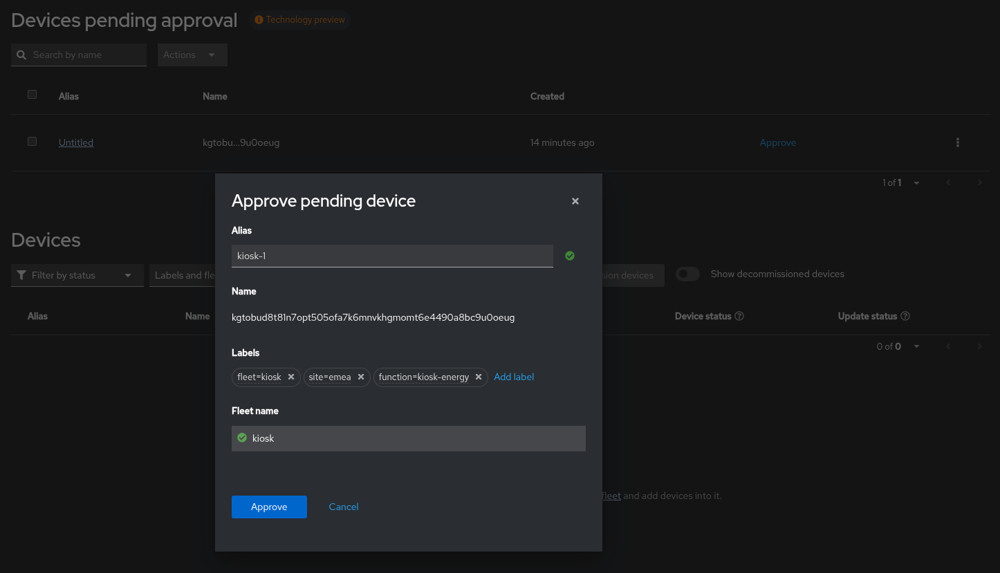
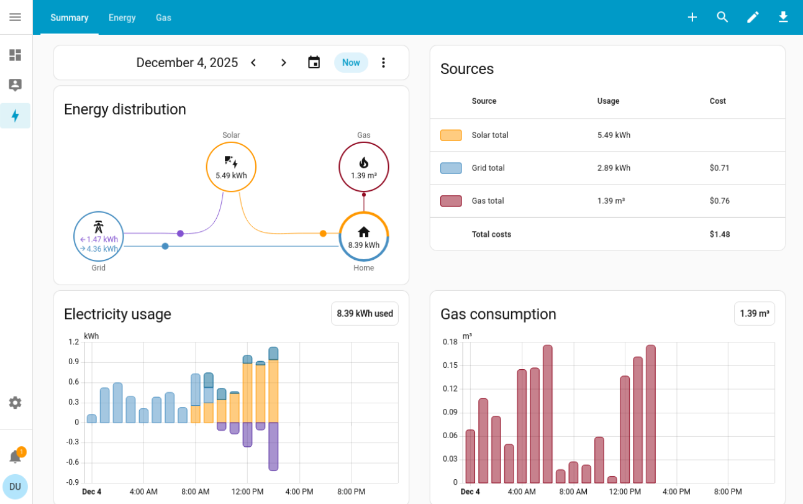
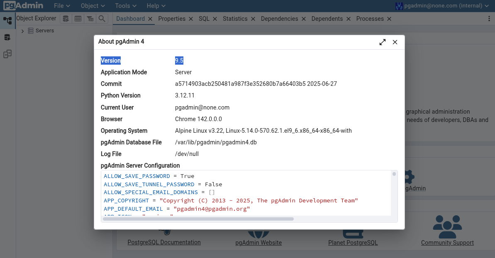
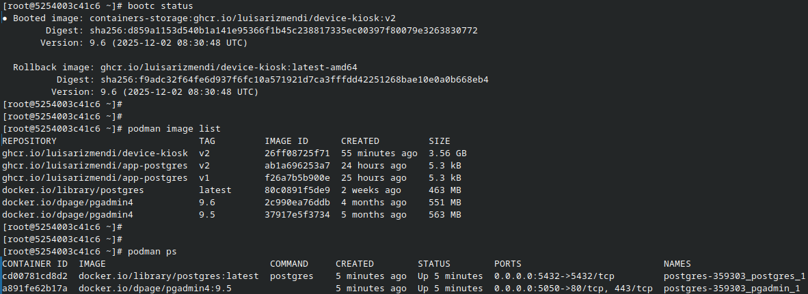
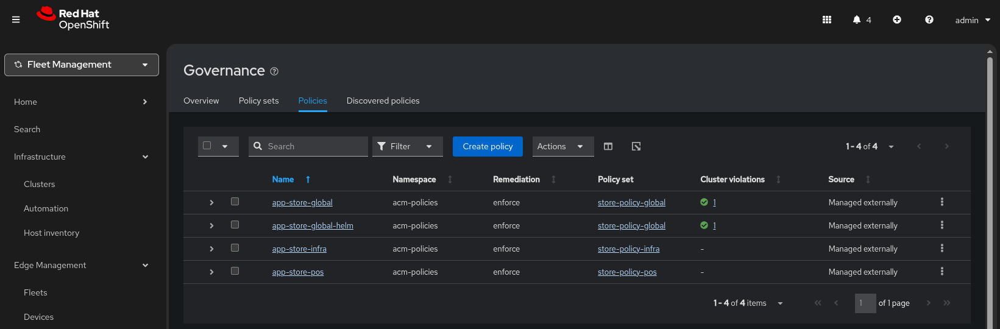

# Demo Script

A step-by-step guide for running the Red Hat Edge Manager demo. Each section includes timing, key points, and detailed steps.

## Demo Introduction (5 minutes)

### Opening Points
- Edge computing challenges: scale, remote locations, limited IT expertise
- Network constraints and security requirements  
- Resource limitations and operational complexity

### Environment Overview
- **Demo setup**: Explain RHEM deployment
- **Production reality**: RHEM integrates with Ansible Automation Platform or ACM
- **Infrastructure**: Single laptop demonstration with VMs simulating edge devices

---

## 1. Building Device Images (10 minutes + background)

### Key Messages
- Bootc leverages container tools and knowledge for OS image creation
- Images embed RHEM agent, certificates, and endpoint configuration
- Alternative: Generic images with runtime configuration via cloud-init
- Container registry benefits: signatures, security scans, distribution


### Demo Steps

1. **Show bootc Images Containerfile**:
   Open one of the Containerfiles under `devices` directory in your repo and show how that `config.yaml` file is embeded into the image, and how the rhem agent is installed.


2. **Demonstrate image building**:
   Introduce a change in the `Containerfile`:

   ```bash
   # Make a visible change (e.g., add zsh package)
   vi `devices/kvm/Containerfile`
   ```

   Push the change into Git:

   ```bash
   git add devices
   git commit -m "Add zsh package"
   git push
   ```

3. **Show GitHub Actions workflow**:
   - Open repository **Actions** tab
   - Point out automated multi-arch builds
   - Explain versioning strategy

4. **Continue with next section** (build runs in background)





### What to Mention
- Two image types: KVM (general purpose) and Kiosk (display applications)
- Subscription handling in GitHub Actions vs. registered RHEL hosts
- Installable artifacts: ISO, QCOW2, AMI, VMDK options

---

## 2. Device Onboarding (10 minutes)

### Key Messages  
- Zero-touch provisioning reduces onsite expertise requirements
- Secure pull-mode communication (no inbound firewall ports needed)
- QR code provides convenient UI access
- Decoupled image and installation artifact approach

### Demo Steps

1. **Create and boot VMs**:

   - Depending on the Images that you want to use, create one or multiple of these machines:

   **Note:** If you want to demo Microshift, create either the `kiosk` or `kvm` VM to show RHEL configuration capabilities and one additional `microshift` VM to demo ACM integration. Maintain the `microshift` VM powered off until you start the Microshift management demo steps.

   These are the recommended resources for each type:

   * Kiosk VM
      - 1.5GB RAM, 2 vCPUs, 20 GB Disk
      - Boot from Kiosk device ISO

   * KVM VM
      - 4GB RAM, 4 vCPUs, 50 GB Disk
      - Boot from KVM device ISO

   * Microshift VM
      - 4GB RAM, 4 vCPUs, 50 GB Disk
      - Boot from Microshift device ISO

   - **Wait time**: ~3:30 minutes

2. **During boot wait, explain**:
   - USB with ISO boot simulation (could be PXE in production) instead of direct QCOW2 usage (for demo propouses)
   - Device pulls image and configures itself
   - Automatic certificate-based authentication

3. **Handle enrollment request**:
   - When the Kiosk APP appears, open RHEM UI
   - Show enrollment request with device details
   - DO NOT accept the enrollment, that will be done in next step




### What to Mention
- No technical expertise required onsite
- Simplified network configuration (outbound-only)
- Scalable across hundreds/thousands of devices


---

## 3. Fleet Management (10 minutes)

### Key Messages
- Scale from individual devices to fleet operations
- Template-based configuration for flexibility
- Git-based fleet definitions (GitOps approach)
- Label-based device assignment and configuration

### Demo Steps

1. **Create fleet from Git**:
   - RHEM UI → `Repositories`
   - Create a repository:
         * Name: `rhem-demo`
         * URL: `https://github.com/<your user>/<your repo>`
         * Sync name: `rhem/fleets`
         * Revision: `main`
         * Path: `/rhem/fleets`
   - Show the `fleet.yaml` file or/and how to create a fleet manually in the UI while waiting for sync completion (~1.5 minutes). 
   - Show fleet in `Fleets` section

2. **Enroll with fleet labels**:
   - Back to `Devices` and click in `Approve`
   - Assign labels for:
     * Your fleet(`kvm`, `kiosk` or `microshift`), e.g `fleet=kiosk`
     * Your site with `site=na` or `site=emea`  
     * Your function with `function=<directory name under configs/function>`, e.g. `function=kiosk-energy`
   - Accept enrollment

3. **Wait for drift detection**:
   - Explain drift detection process
   - Explain tahat full configuration takes several minutes (~6.5 minutes) because it needs to download some container images for the APPs
   - Move on to the next demo step while device is updating.




### What to Mention
- Single fleet definition supports multiple configurations
- Reduces management overhead
- Consistent policy application
- Flexible device categorization


---

## 4. Check Configuration Management (5 minutes)

### Key Messages
- Runtime configuration preferred over build-time when needed
- Git-based configuration management (GitOps benefits) such as change tracking and rollback capabilities
- Site-specific or security-sensitive configurations must be in runtime, not in image

### Demo Steps

1. **Show configuration config in fleet definion**:
   - Open [rhem/fleets/kiosk.yaml](../rhem/fleets/kiosk.yaml) and show the config section
   - Click Create a new Fleet in RHEM to show the Configuration management options


2. **Verify configuration**:
   ```bash
   # SSH or VM console login
   ssh user@device-ip
   # MOTD should display the configured message
   ```





### What to Mention
When to Use Runtime Configuration:
- Site-specific network credentials
- Deployment-specific settings  
- Security credentials (not safe in images)
- Frequently changing parameters


---

## 5. Check Application Deployment (10 minutes)

### Key Messages
- Container applications managed separately from OS lifecycle
- OCI registry distribution for consistency
- Docker Compose for multi-container applications
- Faster update cadence than OS updates

### Demo Steps

1. **Show application definition**:
   ```bash
   # Show compose file and how it's packaged
   cat apps/compose/postgres/compose.yaml
   cat apps/compose/postgres/Containerfile
   ```

2. **Deploy application (v1)**:
   - Open device in RHEM UI
   - Configure application:
     - Image: `ghcr.io/luisarizmendi/app-postgres:v1`
     - Environment variables:
       ```
       POSTGRES_USER=postgres
       POSTGRES_PW=pgredhat
       POSTGRES_DB=postgres
       PGADMIN_MAIL=pgadmin@none.com
       PGADMIN_PW=pgredhat
       ```

3. **Monitor deployment**:
   - **Wait time**: ~4 minutes for image pulls and startup
   - Optional: Show container activity:
     ```bash
     # terminal 1
     watch 'podman image list; echo ""; podman ps'
     ```

     ```bash
     # terminal 2
     journalctl -f 
     ```     

4. **Verify application**:
   - Access pgAdmin: `http://device-ip:5050`
   - Login with configured credentials
   - Show pgAdmin version (9.5)
   - Optional: Configure PostgreSQL connection




###  What to Mention
- Independent application lifecycle
- Faster updates than OS changes
- Container ecosystem advantages
- GitOps configuration management


---

## 6. Operating System Upgrades (10 minutes)

### Key Messages
- Bootc enables image-based OS updates
- Atomic updates with rollback capability
- Mobile phone-style OS upgrade experience (reboot needed)
- Combines OS, configuration, and embedded applications

### Demo Steps


5. **Demonstrate upgrade to v2**:
   - Edit device application configuration
   - Change image to: `app-postgres:v2`
   - **Wait time**: ~2 minutes for upgrade
   - Login to pgAdmin again, show version 9.6


1. **Check current OS version**:
   ```bash
   # SSH to device
   bootc status
   # Note the current image version
   ```

2. **Configure OS image in RHEM**:
   - Edit device in RHEM UI
   - Set bootc image: `ghcr.io/luisarizmendi/device-demo-kvm:v2`
   - Apply changes

3. **Monitor upgrade process**:
   - **Wait time**: ~5 minutes total
   - Device downloads new image
   - Stages update and reboots
   - Show RHEM UI status during process

4. **Verify upgrade**:
   ```bash
   # After reboot, SSH to device
   bootc status
   # Confirm new image version
   ```

   Open `https://device-ip:9090` to show the Cockpit console.





###  What to Mention
- Benefits of bootc upgrades (atomic, consistent, and reproducible updates).


---

## 7. Microshift management with ACM (15 minutes)

### Key Messages
- RHEM is integrated with ACM to simplify k8s App management in RHDE
- Zero-Touch Provisioning for k8s APPs after cluster group assignment
- GitOps methodogy management benefits


### Demo Steps

1. **Log into the Microshift VM**
   - Turn on the `microshift` VM and wait until QR appears in the VM console.
   - SSH into the VM with `admin / redhat` (if you didn't change defaults)
   - Run the following command to check all PODs runnin in Microshift: `watch oc get pod -A`
   - Keep the output visible while you go through the next steps.
   - Open a new SSH console and add your pull-secret: `vi /etc/crio/openshift-pull-secret` 

**Note:** The pull secret was not included [in the image](https://github.com/luisarizmendi/rhem-demo/blob/main/devices/microshift/files/etc/crio/openshift-pull-secret) or [in the fleet configuration](https://github.com/luisarizmendi/rhem-demo/blob/main/rhem/fleets/microshift.yaml) because the GitHub repo is public and there is no secret store configured for it, but the appropiate security measures you won't need this manual step.

2. **Accept enrollment request**:
   - Open RHEM UI in ACM and open the enrollment request.
   - Assign the `microshift` fleet by adding the label `fleet=microshift` and accept the enrollment
   - Check changes in the `watch` command output, you will see how Advance Cluster Management components are added to Microshift.
   - **Wait time**: ~3 minutes for green status checks. You can use this time to explain the different ways ACM can manage k8s applications and clusters.

3. **Assign labels to Microshift and add it to ClusterSet**:
   - In `Infrastructure > Clusters` find the new Microshift cluster
   - Add the following labels to the cluster by click the three dots on the right of the cluster.
     - Your site label, either `site=na` or `site=emea`  
     - Your function label, either `function=pos` or `function=infra`
   - Assign the Microshift cluster to the `stores` ClusterSet by XXXXXXXXXXXXXXXXXXXXXXXXXXXXXXXXXXXXXXXXXX

4. **Review device compliance**
   - Check in ACM `Governance` how the Policies were assigned to the device. It could take a couple of minutes.
   - Check changes in the `watch` command output, after some time you will see two new applications. One will be `hello` and the other will depend on your `function` label, it could be either `pos` or `infra`.
   - Run this command in the VM to get the routes to the new APPs: `oc get route -A`

5. **Review deployed APPs**
   - Open the URL for the `hello` APP. You will see a message that will depend on the labels `site` and `function` that you configured in your cluster.
   - Open the URL for the `pos` or `infra` APP




###  What to Mention
- ACM integration unlocks advanced management features
- Zero-Touch provisioning for Microshift APPs
- You can control what APPs are deployed depending on cluster labels and ClusterSet assignment 
- You can control deployed APP configuration depending on cluster labels and ClusterSet assignment 


---

## [OPTIONAL] 8. Device Observability (7 minutes)

### Key Messages
- Built-in device monitoring without additional setup
- Remote terminal access through secure tunnel
- No inbound firewall ports required
- Customizable alerting thresholds

### Demo Steps

1. **Demonstrate terminal access**:
   - Open device in RHEM UI
   - Click **Terminal** tab
   - **Wait time**: ~30-60 seconds for connection
   - Access device shell remotely

2. **Generate system load**:
   ```bash
   # On device terminal through RHEM UI
   stress -c 4 &
   ```

3. **Continue to next section** (alarm will appear later)
   - Monitoring takes time to detect sustained issues
   - Explain alarm threshold configuration
   - Point out monitoring dashboard when alarm appears


###  What to Mention
- CPU, memory, disk utilization
- System health and connectivity status
- Event logs and system metrics
- Customizable alert thresholds and destinations


---

## Demo Wrap-up (5 minutes)

### Key Takeaways
1. **Intuitive Operations**: User-friendly interface bridges IT skills gap
2. **Flexible Management**: On-premises and cloud deployment options  
3. **Policy-Driven**: Desired-state configuration for consistency
4. **Resilient Architecture**: Pull-mode management works in challenging networks
5. **Edge-Hardened Security**: mTLS communication and identity verification
6. **Proactive Insights**: Built-in monitoring and troubleshooting
7. **Complete Lifecycle**: Onboarding through decommissioning support

Now explain the [RHEM value](05-value-propotitions.md).
